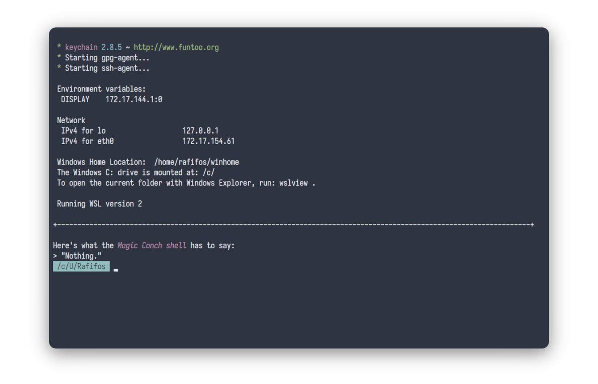

> I was told to leave it alone, but I have this thing called OCD, you see.

## Featuring

- [fish](https://fishshell.com/) as the shell.
- [asdf-vm](https://asdf-vm.com/) as the version manager.
- Others, as the others.

<br>


> Font: Iosevka 14
>
## Hic sunt dracones

These dotfiles are extremely volatile, because they're **my** dotfiles, and I'm volatile. But feel free to make a contribution and to use them as a base for your own dotfiles.

# Package management

My personal configuration uses [Homebrew](https://brew.sh) for managing CLI-only applications, I'm not a fan of installing dependencies directly into the system.

As for GUI applications, I'm using `apt`, it's very easy to mass install packages with it. You just need to redirect a file into `xargs`, and you're good to go.

```shell-session
xargs <packages.txt sudo apt install --assume-yes
```

There are additional steps for some apps, like adding `ppa`s and downloading `.deb`s for files that aren't shipped by a repository.

## Credits

- [Sven Greb](https://github.com/arcticicestudio), i've used many parts of his [dotfiles](https://github.com/arcticicestudio/igloo).
