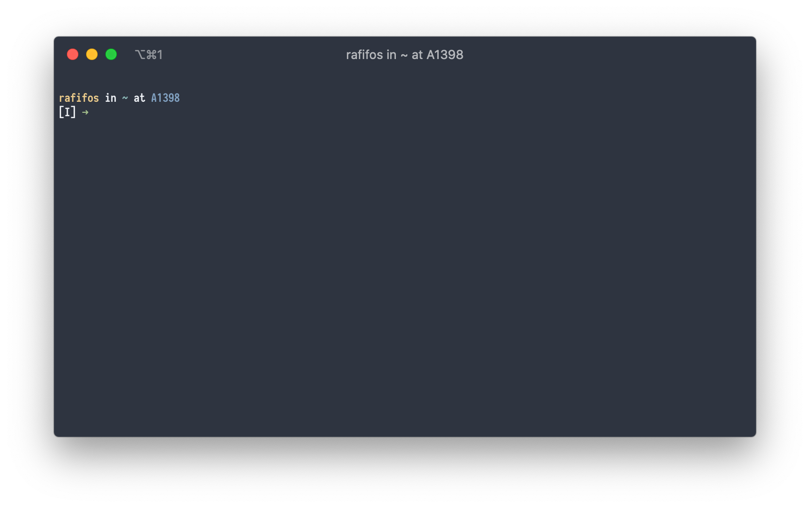

# Zsh configuration

> Font: Iosevka 12, Theme: Nord

This shell configuration is powered by [ZIM - Zsh IMproved FrameWork](https://github.com/zimfw/zimfw) and features:

- Fish-shell history navigation
- Syntax highlighting
- And much more!

## How to choose where to put a setting

- If it is needed by a **command run non-interactively**: `.zshenv`
- If it should be **updated on each new shell**: `.zshenv`
- If it runs a command which **may take some time to complete**: `.zprofile`
- If it is related to **interactive usage**: `.zshrc`
- If it is a **command to be run when the shell is fully setup**: `.zlogin`
- If it **releases a resource** acquired at login: `.zlogout`

Source: [Unix & Linux Stack Exchange](https://unix.stackexchange.com/a/487889)
